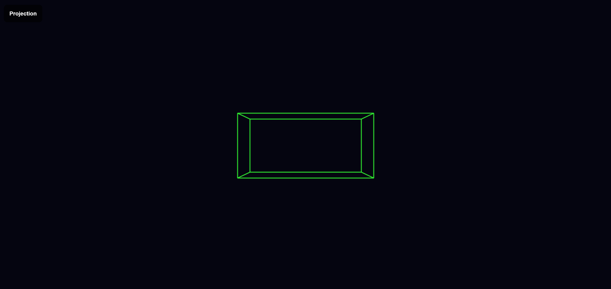
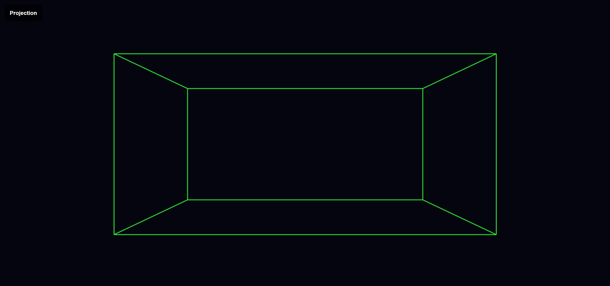

# Homework 2 - First Rendering Algorithm

## The Homework's Overview

For homework2 I applied my first rendering algorithm in HTML and JavaScript.

### Goals

The goal was to render a 3D cube by applying the pinhole camera perspective to create a 2D image. Additionally, provide moving camera views by key press.

### Process

#### 3D Cube Render

Given that the camera is positioned at `camera = {x: 0, y: 0, z: -10}`, I first had to convert the vertex coordinates into coordinates relative to the camera position by subtracting the camera coordinates.

```javascript
camVert.x = vertices[v].x - camera.x;
camVert.y = vertices[v].y - camera.y;
camVert.z = vertices[v].z - camera.z;
```

To achieve the projected position of the camera vertices on the canvas I divided the vertices by `z`.

```javascript
canvasPos.u = camVert.x / camVert.z;
canvasPos.v = camVert.y / camVert.z;
```

Now to compute the projected vertices `(u1, v1)` and `(u2, v2)` for each edge, there was one thing to point out. For certain graphics systems, the y-coordinate increases downwards. So, in this case `v1` and `v2` are calculated as shown below:

```javascript
let e1 = edges[e][0];
let u1 = projectedVertices[ e1 ].u;
let v1 = canvas.height - projectedVertices[ e1 ].v;
```

#### Camera Movement

To have the camera position change with a key press, I added the following lines:

```javascript
camera.z += 0.1; // camera moves closer
camera.z -= 0.1; // camera moves further away
camera.x -= 0.1; // camera moves left
camera.x += 0.1; // camera moves right

// camera position resets
camera.x = 0;
camera.y = 0;
camera.z = -10;
```

### Result


*3D Rendered Cube*


*Camera is Close to Cube*


*Camera is Far from Cube*


*Camera is Left of Cube*


*Camera is Right of Cube*