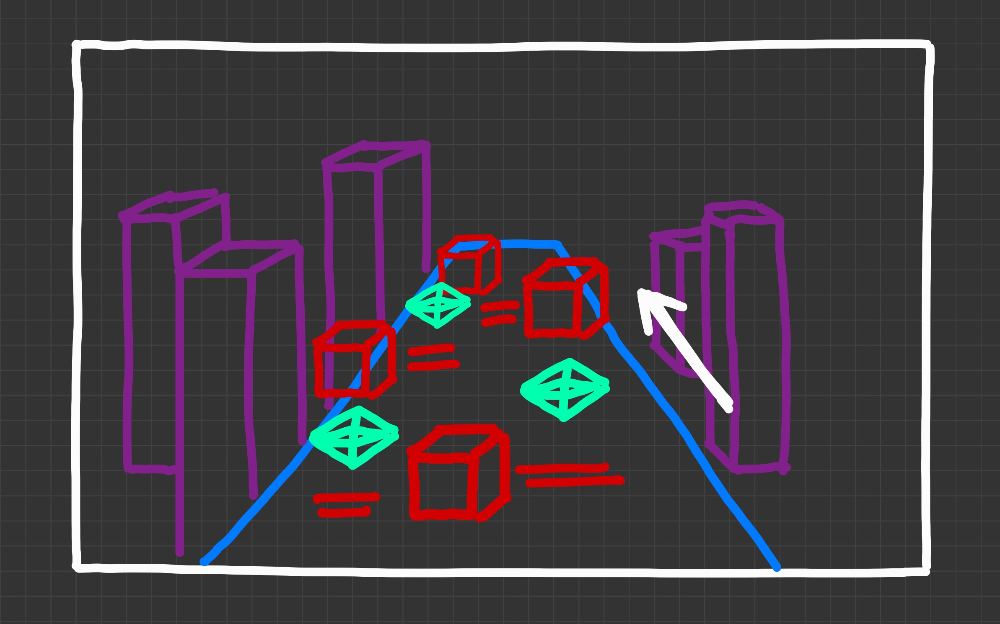
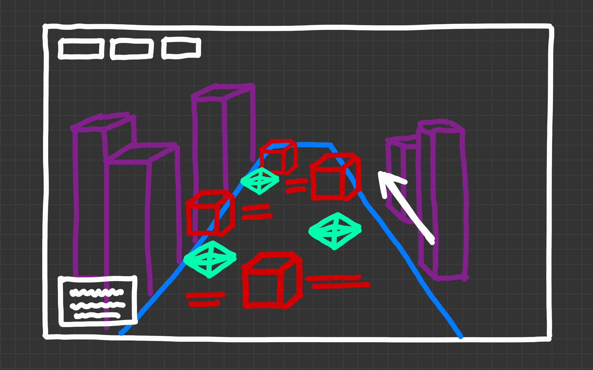
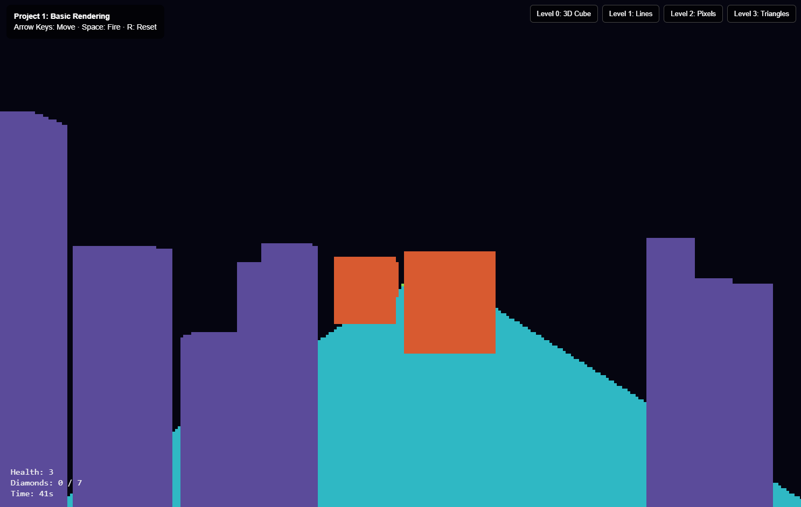
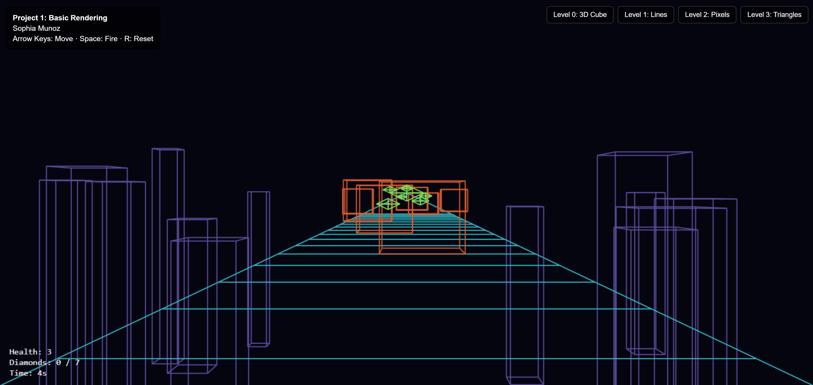
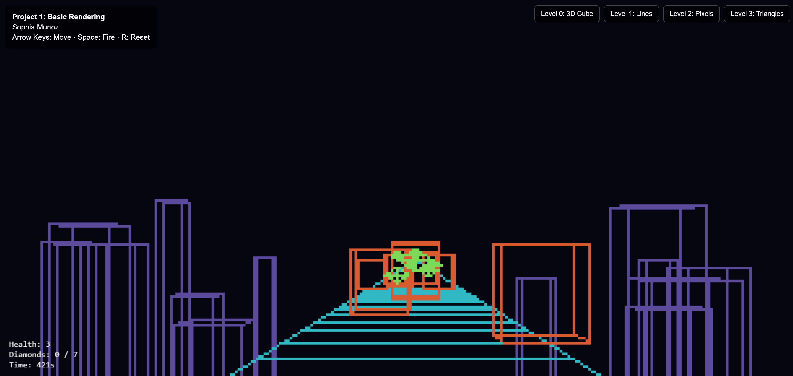
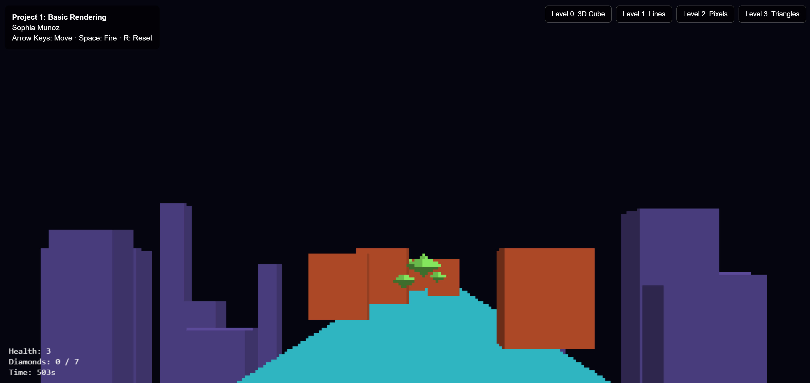

# Project 1 - Pinhole Camera, Rasterized Display

## The Project's Overview

### **Goals**

The goal for this project was to create a web application in `HTML`, `CSS`, and `JavaScript` to develop a minigame using the *canvas API* to implement a rasterized display in three different render levels.

### **Process**

**Design**

My design for Project 1 is based on a trench run style game that is first person. The goal of this minigame is to collect all of the diamonds in a run without losing all your health points. Colliding with a red block or falling over the edge of the elevated floor means a loss of health points or a game over.




**Object Types**

- **Block:** A cube \(reused from Homework 2) that acts as an obstacle. A player colliding with with cube costs the player 1 health. The player can be pushed off the floor by the cube and lose the game. Shooting a cube destroys it. During development, I added movement to the cube to increase the diamond collecting difficulty using an offset of a sine-wave.
- **Diamond:** An octahedron where colliding with the diamond contributes to the win condition of the game.
- **Floor / Floor Grid:** A large rectangle that simulates an infinite floor. The floor grid was added later in development to add a visual aid in movement when the player moves.

**Win / Lose Condition**

- **Win:** Every diamond has been collected.
- **Lose:** Health reaches 0 from colliding into blocks or going over the floor's edge.
- **Score:** If all the diamonds are collected. The score is calculated `score = (diamonds collected * 100) - elapsed seconds` and it is doubled if no health points were lost.

#### **Implementation**

**File Structure**

| File | Responsibility |
|---|---|
| **`index.html`** | Page Structure, Header, Level-Select Buttons |
| **`style.css`** | Visual Styling for header and level control |
| **`object.js`** | Object type definitions \(vertices, edges, triangles) and instances |
| **`camera.js`** | State of camera and pinhole projection math |
| **`input.js`** | Keyboard input \(movement, fire, reset) |
| **`render-level0.js`** | Level 0: The original HW2 cube, no minigame logic |
| **`render-level1.js`** | Level 1: Minigame, using canvas' line drawing function |
| **`render-level2.js`** | Level 2: Minigame, rasterized 320x200 pixel display |
| **`render-level3.js`** | Level 3: Minigame, triangles implemented with shading and depth |
| **`main.js`** | Game loop, status (health, score, win, lose), collision detection |

**Level 0:** *Project Preliminaries*

Level 0 uses the canvas library to display a cube drawn by lines. The camera is able to translate using the keyboard arrow keys. I reused the main projects camera object and existing `projectVertex()` function to avoid duplication code.

**Level 1:** *Wire-Frame, Pinhole Camera*

Level 1 implements the full minigame using `ctx.lineTo()` and `ctx.stroke()`. I created instances of blocks and diamonds using simple base geometry. Each object has its own position, scale, and color. For the floor grid and building I created a regenerative function to recycle the objects to appear or disappear as the camera moves. For the block and diamond, I implemented a bounding box for collision detection. For the shooting action I created a cooldown limited fire mechanic the win and lose condition and a simple heads up display that allows the player to see their health, diamond left to collect and time taken.

**Level 2:** *Lower Resolution, Line Drawing*

Level 2 has all the same game mechanics as Level 1. The difference is in the graphics themselves. The lines are rasterized into a 320x200 pixel grid using a line-drawing algorithm and projected as 5x5 pixel blocks.

**Level 3:** *Triangles and Triangle Fill*

Level 3 as well has the same game mechanics as Level 1 and 2. This level is filled in with triangles. I used a depth buffer to determine the surface distance from a pixel and applied shading to add to that 3D perspective.

---

**Applied Computer Graphics Concepts**

*Pinhole Camera Projection*

For projection, I converted each vertex to coordinates relative to the camera \(`toCamerSpace()` in `camera.js`) by subtracting the camera's position and projecting the coordinates that are given by the `u = x / z` and `v = y / z` coordinates.

```javascript
x: vertex.x - camera.x,
y: vertex.y - camera.y,
z: vertex.z - camera.z
```

```javascript
u: camVert.x / camVert.z,
v: camVert.y / camVert.z,
// z-buffer value for depth
z: camVert.z
```

The `u,v` coordinates provide a perspective of distance. I also made sure to scale and center the objects onto the canvas \(`projectCameraSpace()` in `camera.js`).

```javascript
canvasPos.u = canvasPos.u * canvasWidth + canvasWidth / 2;
canvasPos.v = canvasPos.v * canvasHeight + canvasHeight / 2;
```

*Modeling Transforms and Instances*

I made sure to define every object type created once. The objects are centered at the origin and have their own local coordinates. To allow more than one object to share vertex and edge data I implemented a modeling transform where each instance has their own position, scale, and color. This avoids duplicating the geometry per instance.

*Near-Plane Clipping*

To resolve a bug where a vertex behind the camera creates nonsensical projected coordinates due to a negative `z` value being divided by it, I implemented two solutions:

- **Line Clipping:** For Level 1 and 2, I used linear interpolation to find the exact point at which an edge point crosses the near plane and only have the visible part of the line drawn. This solution was not implemented in Level 0, so the bug is present when the user advances through the cube and past it.
- **Polygon Clipping:** For Level 3, I used the **Sutherland-Hodgman Algorithm**. Which basically goes through the three triangle edges and creates a new point list from the vertices and intersections that are visible to the user. The function below is the algorithm applied.

```javascript
function clipTriangleAgainstNearPlane(points) {
    let outputPoints = [];

    for (let i = 0; i < 3; i++) {
        let current = points[i];
        let next = points[(i + 1) % 3];
        let currentInside = current.z > NEAR_PLANE;
        let nextInside = next.z > NEAR_PLANE;

        if (currentInside) {
            outputPoints.push(current);
            if (!nextInside) {
                outputPoints.push(intersectNearPlane(current, next));
            }
        } else if (nextInside) {
            outputPoints.push(intersectNearPlane(current, next));
        }
    }

    if (outputPoints.length === 3) return [outputPoints];
    if (outputPoints.length === 4) {
        return [
            [outputPoints[0], outputPoints[1], outputPoints[2]],
            [outputPoints[0], outputPoints[2], outputPoints[3]]
        ];
    }
    return []; // fully behind the near plane
}
```

*Line Rasterization*

Level 1 uses the canvas library, like `moveTo`, `lineTo`, `stroke`.
Level 2 uses a line drawing algorithm that I decided to implement. The Digital Differential Analyzer Algorithm \(DDA) essentially an incremental solution that was provided in the lecture slides. A slope-intercept equation closely resembles it. The code below is its implementation.

```javascript
function drawPixelLine(u1, v1, u2, v2, color) {
    let du = u2 - u1;
    let dv = v2 - v1;
    let steps = Math.max(Math.abs(du), Math.abs(dv));

    if (steps === 0) {
        setPixelColor(u1, v1, color);
        return;
    }

    let uStep = du / steps;
    let vStep = dv / steps;

    let u = u1;
    let v = v1;

    for (let i = 0; i <= steps; i++) {
        setPixelColor(u, v, color);
        u = u + uStep;
        v = v + vStep;
    }
}
```

*Triangle Rasterization*

Level 3 implements the triangle rasterization. Based off the provided triangle rendering tutorial \(https://jtsorlinis.github.io/rendering-tutorial/), for each pixel in a bounding box three edge functions are computed. The area of each is signed and if they all match \(`+++` or `---`) it means that the pixel is inside the triangle.

To get the barycentric coordinates I normalized the values by the triangles total area. Each vertex has a weight to it that determines the distance of the point to each vertice. I also continued to use these weights for depth interpolation and pixel shading.

```javascript
function edgeFunction(a, b, c) {
    return (b.x - a.x) * (c.y - a.y) - (b.y - a.y) * (c.x - a.x);
};

let depthBuffer = Array.from({ length: PIXEL_COLS }, () => Array(PIXEL_ROWS).fill(0));

function clearDepthBuffer() {
    for (let u = 0; u < PIXEL_COLS; u++) {
        for (let v = 0; v < PIXEL_ROWS; v++) {
            depthBuffer[u][v] = 0;
        }
    }
}

function drawTriangle(A, B, C, color) {
    let ABC = edgeFunction(A, B, C);

    // if triangle is back-facing, it isn't drawn
    if (ABC < 0) {
        return;
    }
    
    // store 1/z per pixel : the higher it is the closer it is to the camera (so basically distance)
    // provides linearity in screen space under perspective projections instead of just z
    let inverseA = 1 / A.z;
    let inverseB = 1 / B.z;
    let inverseC = 1 / C.z;

    // initialize point
    let P = { x: 0, y: 0 };

    // get bounding box of the triangle
    let minX = Math.max(0, Math.floor(Math.min(A.x, B.x, C.x)));
    let minY = Math.max(0, Math.floor(Math.min(A.y, B.y, C.y)));
    let maxX = Math.min(PIXEL_COLS - 1, Math.ceil(Math.max(A.x, B.x, C.x)));
    let maxY = Math.min(PIXEL_ROWS - 1, Math.ceil(Math.max(A.y, B.y, C.y)));

    // loop through all the pixels of the bounding box
    for (P.y = minY; P.y <= maxY; P.y++) {
        for (P.x = minX; P.x <= maxX; P.x++) {
            // calculate edge functions
            let ABP = edgeFunction(A, B, P);
            let BCP = edgeFunction(B, C, P);
            let CAP = edgeFunction(C, A, P);

            // if all the edge functions are positive, the point is inside the triangle
            if (ABP >= 0 && BCP >= 0  && CAP >= 0) {
                // normalize the edge functions by dividing by the total area to get the barycentric coordinates
                let weightA = BCP / ABC;
                let weightB = CAP / ABC;
                let weightC = ABP / ABC;

                // interpolate 1/z
                let inverseDepth = inverseA * weightA + inverseB * weightB + inverseC * weightC;

                // if 1/z is bigger, then object is nearer
                if (inverseDepth > depthBuffer[P.x][P.y]) {
                    depthBuffer[P.x][P.y] = inverseDepth;

                    // draw the pixel
                    setPixelColor(P.x, P.y, color);
                }

                
            }
        }
    }
}
```

*Depth Buffer and Interpolation*

To fix a bug where overlapping triangles ruined the perspective of the object placements, I added a z-buffer to resolve which triangle was visible at a given pixel. The depth buffer essentially stores the closest depth at every pixel and new triangle is only drawn if the pixel is closer than what is currently there. An issued that I came across while interpolation with just the `z` value is that it is not linear in perspective projection.

The solution was to interpolate using `1/z`, so it could be linear. I came across this fix in Scratchapixels article on the depth buffer visbility problem. Below is an image of the issue before the fix.


*Depth Buffer Bug Before Fix*

*Shading*

To add shading to the triangles to have that 3D effect, the brightness is computed once for each triangle. I applied the Lambertian Reflectance model from Scratchapixel. The model has two edge vectors of a triangle combined through cross product to get the face's normal. This normal is compared to the fixed light direction using the dot product.

Whena face is pointed more directly towards the fixed light, the brighter it is.

```javascript
function computeFaceShade(vertices, tri) {
    let a = vertices[tri[0]];
    let b = vertices[tri[1]];
    let c = vertices[tri[2]];

    // two edges of the triangle, in the object's local space
    let e1 = { x: b.x - a.x, y: b.y - a.y, z: b.z - a.z };
    let e2 = { x: c.x - a.x, y: c.y - a.y, z: c.z - a.z };

    // compute face normal direction with cross product
    let nx = e1.y * e2.z - e1.z * e2.y;
    let ny = e1.z * e2.x - e1.x * e2.z;
    let nz = e1.x * e2.y - e1.y * e2.x;

    let len = Math.sqrt(nx * nx + ny * ny + nz * nz) || 1;
    nx /= len; ny /= len; nz /= len;

    // fixed light direction
    let lx = 0.3, ly = 0.8, lz = -0.5;
    let llen = Math.sqrt(lx * lx + ly * ly + lz * lz);
    lx /= llen; ly /= llen; lz /= llen;

    let dot = nx * lx + ny * ly + nz * lz;
    return 0.5 + Math.max(0, dot) * 0.6; // ranges roughly 0.5 (dark) to 1.1 (bright)
}
```

*Camera-Relative Object Regeneration*

The compute the appearance of an infinite floor, I used the floor grid and buildings to appear infinite in an efficient way. To accomplish this for the floor, I created a rectangle that is just scaled to have a really big z value `1000`. To give the illusion of forward and backward movement I created the floor grid and buildings that can be repeated using a fixed size of instances. I defined a span's distance forward and backward whenever the objects are no longer visible to the camera.

```javascript
function regenerateFloorGrids() {
    // used AI to implement this solution
    // regenerate floor grid foward/backward
    for (let i = 0; i < floorGrids.length; i++) {
        let grid = floorGrids[i];

        while (grid.position.z < camera.z - GRID_SPACE) {
            grid.position.z += GRID_SPAN;
        }
        while (grid.position.z > camera.z + GRID_SPAN - GRID_SPACE) {
            grid.position.z -= GRID_SPAN;
        }
    }
}

function regenerateBuildings() {
    for (let i = 0; i < buildings.length; i++) {
        let building = buildings[i];

        while (building.position.z < camera.z + BUILDING_MIN_DISTANCE) {
            building.position.z += BUILDING_SPAN;
        }
        while (building.position.z > camera.z + BUILDING_MIN_DISTANCE + BUILDING_SPAN) {
            building.position.z -= BUILDING_SPAN;
        }
    }
}
```

*Collision Detection*

For the collision detection of the block and diamond objects, I created a bounding box which checks if the camera is colliding with an object if its position falls within `object.position +- object.scale` for the x and z axes. I based my implementation off the collision detection tutorial provided by MDN.

```javascript
function collisionDetection() {
    if (cubeCollision > 0) cubeCollision -= 1;
    if (shotCooldown > 0) shotCooldown -= 1;

    // user collides with block, loses 1 health
    for (let i = 0; i < cubes.length; i++) {
        let cube = cubes[i];
        if (cube.destroyed) continue;

        let halfX = typeof cube.scale === "number" ? cube.scale : cube.scale.x;
        let halfZ = typeof cube.scale === "number" ? cube.scale : cube.scale.z;

        if (
            camera.x > cube.position.x - halfX && camera.x < cube.position.x + halfX &&
            camera.z > cube.position.z - halfZ && camera.z < cube.position.z + halfZ
        ) {
            let overlapX = halfX - Math.abs(camera.x - cube.position.x);
            let overlapZ = halfZ - Math.abs(camera.z - cube.position.z);

            if (overlapX < overlapZ) {
                camera.x += camera.x < cube.position.x ? -overlapX : overlapX;
            } else {
                camera.z += camera.z < cube.position.z ? -overlapZ : overlapZ;
            }

            if (cubeCollision <= 0) {
                health -= 1;
                noDamageBonus = false;
                cubeCollision = 30;
                console.log("Hit a block! Health: ", health);
            }           
        }
    }

    // user collides with diamond, score increases 1
    for (let i = 0; i < octahedrons.length; i++) {
        let diamond = octahedrons[i];
        if (diamond.destroyed) continue;

        let half = diamond.scale;

        if (
            camera.x > diamond.position.x - half && camera.x < diamond.position.x + half &&
            camera.z > diamond.position.z - half && camera.z < diamond.position.z + half
        ) {
            score += 1;
            diamond.destroyed = true;
            console.log("Collected a diamond!", score);
        }
    }
}
```

**Future Work**

Due to time contraints there were a couple more things I would have added to improve this project.

| Future Additions | | |
| --- | --- | --- |
| **Game System** | Improve Combat System | Implement Rail Shooter |
| **Gameplay Loop** | Add enemy that shoots lasers at player | Improve diamond collection multiplier system |
| **Interface** | Improve object design and details | Add details to the background |

**Citations**

- Geeks For Geeks - DDA Line Generation Algorithm Computer Graphics:
  https://www.geeksforgeeks.org/computer-graphics/dda-line-generation-algorithm-computer-graphics/
- MDN - 2D Breakout Game Tutorial - Collision Detection:
  https://developer.mozilla.org/en-US/docs/Games/Tutorials/2D_Breakout_game_pure_JavaScript/Collision_detection
- Scratchapixel — Depth Buffer and Interpolation:
  https://scratchapixel.com/lessons/3d-basic-rendering/rasterization-practical-implementation/visibility-problem-depth-buffer-depth-interpolation
- Sutherland–Hodgman Polygon Clipping Algorithm:
  https://www.geeksforgeeks.org/dsa/polygon-clipping-sutherland-hodgman-algorithm/
- MDN — `requestAnimationFrame`:
  https://developer.mozilla.org/en-US/docs/Web/API/DedicatedWorkerGlobalScope/requestAnimationFrame
- Triangle Rendering Tutorial
  https://jtsorlinis.github.io/rendering-tutorial/
- Object Regeneration/Recycling: Copilot
- Introduction to Shading
  https://www.scratchapixel.com/lessons/3d-basic-rendering/introduction-to-shading//diffuse-lambertian-shading.html

### **Result**


*Level 1*


*Level 2*


*Level 3*

[Watch the Demo!](https://youtu.be/mena3BZRrkg)